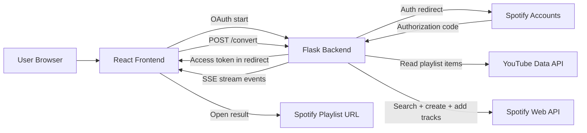
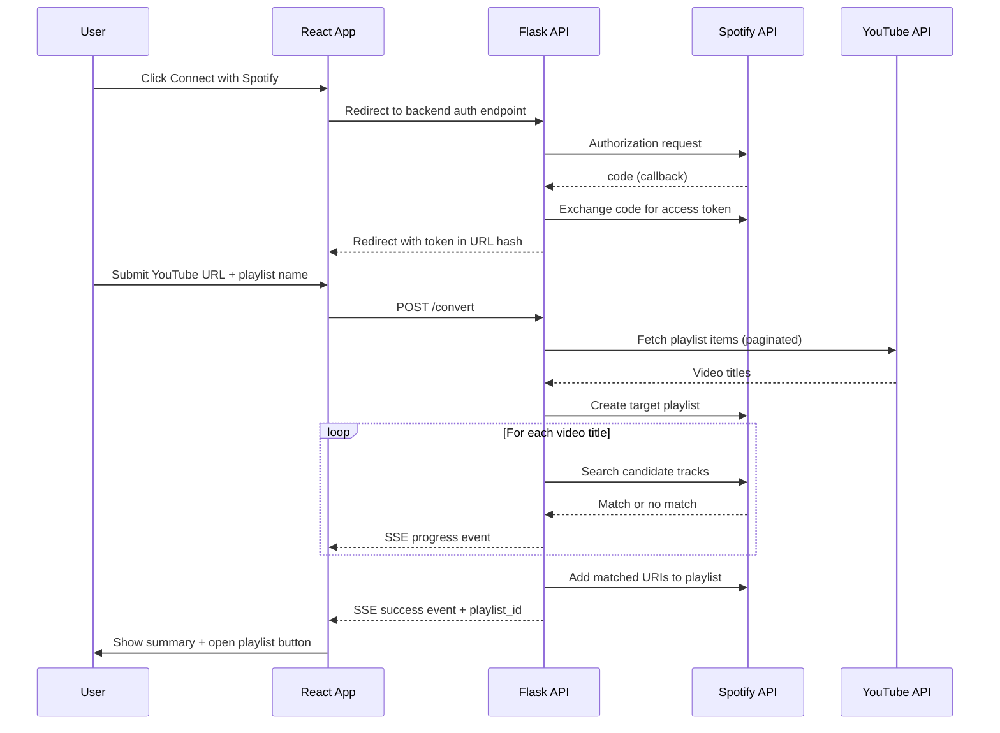

# SYNCTIFY

Convert a YouTube playlist into a Spotify playlist by extracting YouTube video titles, matching them against Spotify tracks, and creating a new playlist in the authenticated Spotify account.

Project URL (frontend): `https://synctify-y2s.vercel.app/`

## 1. What This Project Does

SYNCTIFY is a full-stack app with:
- A Flask backend that handles Spotify OAuth, YouTube playlist reads, Spotify search, playlist creation, and real-time progress streaming.
- A React frontend that handles user authentication state, conversion input, and live conversion logs/progress.

Core user journey:
1. User connects Spotify.
2. User pastes a YouTube playlist URL.
3. Backend fetches YouTube titles.
4. Backend searches Spotify for each title.
5. Backend creates a Spotify playlist and adds found tracks.
6. Frontend renders progress and final result.

## 2. Repository Structure

```text
SYNCTIFY/
├── backend/
│   ├── app.py                 # Flask app + routes + SSE stream
│   ├── spotify_client.py      # Spotify OAuth + playlist + search logic
│   ├── youtube_client.py      # YouTube API client + playlist item extraction
│   ├── converter.py           # Legacy script (currently outdated/inconsistent)
│   ├── spotify.py             # Placeholder token helper (unused)
│   └── requirements.txt       # Python dependencies
├── syntify-frontend/
│   ├── src/
│   │   ├── App.js             # Main UI + streaming parser + app state
│   │   ├── App.css            # Styling and animations
│   │   ├── LoginButton.js     # Duplicate component (unused)
│   │   └── LoginButton.jsx    # Duplicate component (unused)
│   ├── public/
│   │   └── spotify-success.html
│   └── package.json
├── .env.example
└── README.md
```

## 3. High-Level Architecture



## 4. Backend Deep Dive

### 4.1 `backend/app.py`

Main responsibilities:
- Initialize Flask, CORS, and session settings.
- Expose auth and conversion routes.
- Stream conversion progress using Server-Sent Events format (`text/event-stream`).

Routes:
- `GET /ping`: health check.
- `GET /login`: builds Spotify auth URL and redirects user.
- `GET /callback`: receives Spotify auth code, exchanges for token, stores session fields, redirects to frontend with token hash.
- `POST /convert`: executes conversion pipeline and yields incremental progress events.

`/convert` streaming event types currently emitted:
- `info`
- `searching`
- `found`
- `not_found`
- `warning`
- `success`
- `error`

### 4.2 `backend/spotify_client.py`

Main responsibilities:
- Build Spotify OAuth URL.
- Exchange auth code for tokens.
- Query current user (`/me`).
- Create playlist (`/users/{id}/playlists`).
- Search tracks with progressively relaxed matching.
- Add found URIs to playlist.

Track matching strategy (`search_spotify_track`):
1. Clean video title (remove noisy suffixes like “Official Video”, “Lyrics”, etc.).
2. Attempt artist/track extraction (`Artist - Track`).
3. Search Spotify with `artist:` + `track:` query and fuzzy-score top 5.
4. Fallback to full cleaned-title query + fuzzy best-match.
5. Fallback to track-only query.

### 4.3 `backend/youtube_client.py`

Main responsibilities:
- Initialize YouTube Data API client from `YOUTUBE_API_KEY`.
- Iterate playlist pages with `playlistItems().list(..., maxResults=50)`.
- Skip deleted/private entries.
- Heuristically prepend channel name if title lacks source context.

## 5. Frontend Deep Dive

### 5.1 `syntify-frontend/src/App.js`

Main responsibilities:
- Manage auth token in localStorage and state.
- Trigger conversion request.
- Consume streaming response chunk-by-chunk.
- Update progress bar, logs, and success/error UI.

State model:
- Inputs: `ytUrl`, `playlistName`.
- Auth: `loggedIn`, `spotifyToken`.
- Status: `isLoading`, `error`, `responseMsg`, `playlistId`.
- Live progress: `searchProgress` with counters/logs/current track.

### 5.2 Rendering behavior

UI sections:
- Connection section (`Connect with Spotify` / logout state).
- Input card (YouTube URL + optional playlist name).
- Convert button with loading state.
- Live progress module.
- Last logs module.
- Final success CTA (`Open in Spotify`).

## 6. End-to-End Flow (Code-Level)



## 7. API Contracts

### 7.1 `POST /convert`
Request body:
```json
{
  "youtube_url": "https://www.youtube.com/playlist?list=...",
  "playlist_name": "My Playlist",
  "spotify_token": "..."
}
```

Response:
- Streaming `text/event-stream` messages, each line prefixed with `data: `.

Typical success terminal event:
```json
{
  "type": "success",
  "message": "Playlist created successfully! 🎉",
  "playlist_id": "spotify_playlist_id",
  "stats": {
    "total_videos": 42,
    "found_tracks": 30,
    "not_found": 12
  }
}
```

## 8. Local Setup

### 8.1 Prerequisites
- Python 3.10+
- Node.js 18+ recommended
- Spotify Developer app (Client ID/Secret, redirect URI)
- YouTube Data API key

### 8.2 Backend setup
```bash
cd backend
python -m venv .venv
source .venv/bin/activate
pip install -r requirements.txt
```

Create backend env file (example values):
```bash
SPOTIFY_CLIENT_ID=...
SPOTIFY_CLIENT_SECRET=...
YOUTUBE_API_KEY=...
SECRET_KEY=...
```

Run backend:
```bash
python app.py
```

### 8.3 Frontend setup
```bash
cd syntify-frontend
npm install
npm start
```

## 9. Important Environment Notes

Current code behavior to understand before running:
- `backend/spotify_client.py` uses a hardcoded `REDIRECT_URI` (`https://synctify.onrender.com/callback`) instead of reading `.env`.
- Root `.env.example` contains `SPOTIFY_REDIRECT_URI`, but current backend logic does not use it.
- Frontend currently calls backend at hardcoded production URL (`https://synctify.onrender.com`) in `App.js`.

For local development, code changes are recommended so URLs come from environment variables on both sides.

## 10. Reliability and Matching Behavior

Why tracks may not match:
- YouTube titles contain remix tags, lyric tags, uploader text, and release metadata.
- Spotify may store different canonical title/artist formatting.

Current mitigation in code:
- Title cleanup (`clean_title`).
- Artist/track extraction (`extract_artist_and_track`).
- Multi-stage search with fuzzy thresholds.

Tradeoff:
- Higher fuzzy thresholds reduce false positives but increase misses.
- Lower thresholds increase recall but may add wrong songs.

## 11. Current Bugs and Risks (From Existing Code)

1. Frontend login endpoint is incorrect.
- `App.js` uses `https://synctify.onrender.com/callback` for login start, but OAuth should start at `/login`.
- Result: user can hit callback without `code`, causing auth failure.

2. Broken EventSource usage in frontend.
- `new EventSource(..., { method:'POST', body: ... })` is invalid; EventSource only supports GET and ignores these options.
- Object is also never used/closed.

3. Streaming parser is fragile across chunk boundaries.
- SSE parsing splits each incoming chunk by newline directly; JSON lines split across chunks can fail parsing intermittently.

4. Session cookie config likely incompatible with secure cross-site auth.
- Backend sets `SESSION_COOKIE_SAMESITE = None` and `SESSION_COOKIE_SECURE = False`.
- Modern browsers typically require `Secure=true` when `SameSite=None` over HTTPS.

5. Redirect URI configuration mismatch risk.
- Redirect URI is hardcoded in backend module; `.env.example` suggests env-driven value.
- Easy source of OAuth misconfiguration across environments.

6. No refresh token lifecycle handling in app flow.
- Refresh token is returned but not persisted/used in session-based runtime path.
- Expired access token will break conversions until re-login.

7. Playlist add API can fail on large playlists.
- Spotify add-tracks endpoint accepts max 100 URIs per request; current code posts all URIs in one request.

8. `converter.py` is stale/incompatible with current function signatures.
- Calls helper methods with old signatures and would fail if executed.

9. Duplicate unused components.
- `src/LoginButton.js` and `src/LoginButton.jsx` are identical and unused, increasing confusion.

10. Test suite is obsolete.
- `App.test.js` expects “learn react” text that no longer exists.

11. Security risk: access token stored in localStorage.
- Vulnerable to XSS token exfiltration in browser compromise scenarios.

12. Backend runs with `debug=True` in `app.py`.
- Unsafe in production and can expose internals.

## 12. Improvements Roadmap

### 12.1 Immediate (high impact)
1. Fix OAuth start URL in frontend (`/login`, not `/callback`).
2. Remove invalid EventSource construction; keep a robust fetch-stream SSE parser with buffer handling.
3. Move frontend/backend base URLs and redirect URI to env variables.
4. Chunk `add_tracks_to_playlist` requests into batches of 100.
5. Enable secure cookie policy for production (`Secure=True` with HTTPS).
6. Disable Flask debug mode in production.

### 12.2 Short-term
1. Implement refresh-token storage/rotation path.
2. Add backend validation + structured error schema for all routes.
3. Add retry/backoff for transient YouTube/Spotify API failures.
4. Delete or fix stale files (`converter.py`, duplicate login components).
5. Update tests to reflect real UI behavior and API integration.

### 12.3 Medium-term
1. Add persistent conversion history and downloadable not-found report.
2. Add better track disambiguation (duration matching, artist normalization, album metadata).
3. Introduce background jobs for very large playlists and async status polling.
4. Add metrics/logging (success rate, average match rate, API latency).

## 13. Suggested Reading Order For New Contributors

1. `backend/app.py` (route lifecycle + stream contract)
2. `backend/spotify_client.py` (OAuth + search heuristics)
3. `backend/youtube_client.py` (title extraction behavior)
4. `syntify-frontend/src/App.js` (UI state and parser)
5. This README sections 6, 11, and 12 for operational caveats

